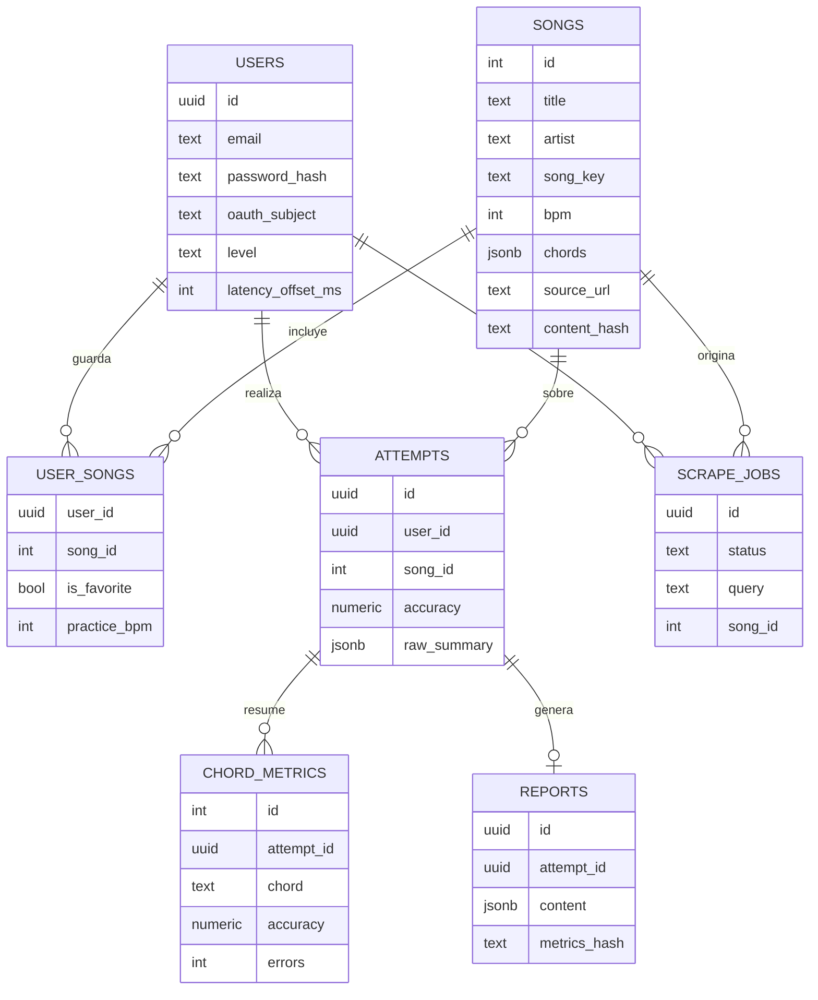

# Diagrama entidad-relación

`song_key` evita la palabra reservada `key`. El audio no tiene tabla: solo se guardan métricas.

```mermaid
erDiagram
    USERS ||--o{ USER_SONGS : guarda
    SONGS ||--o{ USER_SONGS : incluye
    USERS ||--o{ ATTEMPTS : realiza
    SONGS ||--o{ ATTEMPTS : sobre
    ATTEMPTS ||--o{ CHORD_METRICS : resume
    ATTEMPTS ||--o| REPORTS : genera
    USERS ||--o{ SCRAPE_JOBS : pide
    SONGS ||--o{ SCRAPE_JOBS : origina

    USERS {
        uuid id
        text email
        text password_hash
        text oauth_subject
        text level
        int latency_offset_ms
    }
    SONGS {
        int id
        text title
        text artist
        text song_key
        int bpm
        jsonb chords
        text source_url
        text content_hash
    }
    USER_SONGS {
        uuid user_id
        int song_id
        bool is_favorite
        int practice_bpm
    }
    ATTEMPTS {
        uuid id
        uuid user_id
        int song_id
        numeric accuracy
        jsonb raw_summary
    }
    CHORD_METRICS {
        int id
        uuid attempt_id
        text chord
        numeric accuracy
        int errors
    }
    REPORTS {
        uuid id
        uuid attempt_id
        jsonb content
        text metrics_hash
    }
    SCRAPE_JOBS {
        uuid id
        text status
        text query
        int song_id
    }
```
